# Everyday Market App - Angular
by Chanel Cannon

This project was generated using [Angular CLI](https://github.com/angular/angular-cli) version 21.2.11.

This project was created using the help of GitHub Copilot AI Assistant.

Some concepts explained with the help of Claude code (so helpful in breaking down code piece by piece and explaining everything!)

Space pattern found at: [https://pixabay.com/vectors/space-astronomy-spaceships-5654794/](https://pixabay.com/vectors/space-astronomy-spaceships-5654794/)

## Table of Contents
- [Module_1_Assignment](#Module_1_Assignment)
  - Introduction
  - Requirements
  - How it Works
    - Parent Product Page - Child Category Menu
    - Parent Category Menu - Child Category Menu Item
  - Testing
    - Development Server
    - Build
    - Test
    - Home Page
    - Products Page
  - References
- [Module_3_Assignment](#Module_3_Assignment)
  - Introduction
  - Requirements
  - Update Dependencies
  - How it Works
    - Form Validation
    - Custom Validator - countryValidator()
    - Routing
  - Testing
    - Development Server
    - Build
    - Test
    - Lint
    - Register Page
    - Registration Form
      - Submit Alert and Routing
      - Form Validation
  - References
- [Module_4_Assignment](#Module_4_Assignment)

# Module_1_Assignment
completed May 20, 2026

## Introduction
An "Everyday Market App" application made using Angular and Angular CLI to show use of components, data binding (specifically property and event binding), managment of state and component interaction (using @Input(), @Output, and EventEmitter), and application of Angular control flow syntax (using @for and @if).

## Requirements
- Node.js
- Angular CLI
- an IDE (I used Visual Studio Code) with integrated terminal

## How it Works
The application has a global component `Header` with a background image and a navbar, and two page components, `Home` and `Products Page`.

On the `Products Page` page, the focus of this assignment, you will see five categories. These are the `Category Menu Items` components which are bound to the overall `Category Menu`, which is bound to the `Products Page`.

The `Category` interface provides a template for `Category` objects.

### Parent Product Page - Child Category Menu
#### How these components are bound:
`products-page.ts` contains the `categories` array with five `Category` objects.

`category-menu.ts` inputs this list from it's parent via:
```TypeScript
@Input() categories: Category[] = [];
```

`category-menu.ts` outputs the selected `Category` via:
```TypeScript
@Output() selected = new EventEmitter<Category>();
```

`products-page.html` is bound to it's child via property binding:
```Typescript
<app-category-menu [categories]="categories"></app-category-menu>
```

### Parent Category Menu - Child Category Menu Item
#### How these components are bound:
`category-menu.html` supplies each `Category` item `name` in the `categories` array to it's child via the property binding `categoryName` and looping through the array with a control flow `@for`:
```HTML
<div class="categories-grid">
  <ul>
  @for (category of categories; track category.name) {
    <li>
      <app-category-menu-item
        [categoryName]="category.name"
        (click)="onCategorySelected(category.name)">
      </app-category-menu-item>
    </li>
  }
  </ul> 
</div>
```
`category-menu-item.ts` inputs this string from it's parent via:
```TypeScript
@Input() categoryName: string = '';
```
`category-menu-item.html` uses `categoryName` as a variable to print an h3 subheader within that category's box.
```HTML
<div class="category-menu-item" (click)="onItemClick()">
  <h3>{{ categoryName }}</h3>
</div>
```
`category-menu-item.ts` outputs the clicked category name to it's parent via:
```TypeScript
@Output() click = new EventEmitter<string>();

onItemClick() {
  this.click.emit(this.categoryName);
}
```

## Testing
### Development Server
To start a local development server, run:

```bash
ng serve
```

Once the server is running, open your browser and navigate to `http://localhost:4200/`.

### Build
Create a production build
```bash
ng build
```

### Test
Run the unit tests
```bash
ng test
```

### Home Page
Once you have navigated to the local server, the application will load the `Home` page:
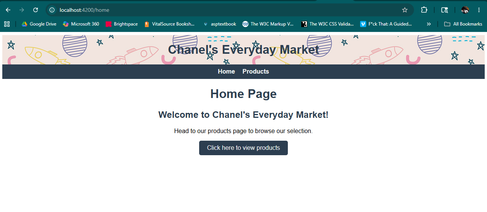

From here, there are two options that Route to the `Products Page` page, via the Nav Bar:
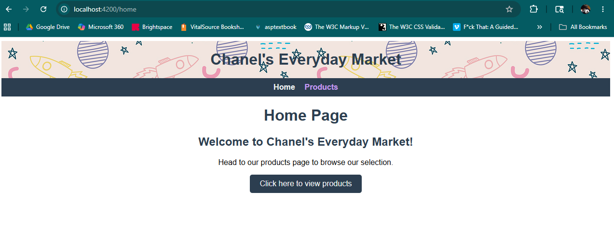

Or via a button I decided to add for UI (and for fun!):
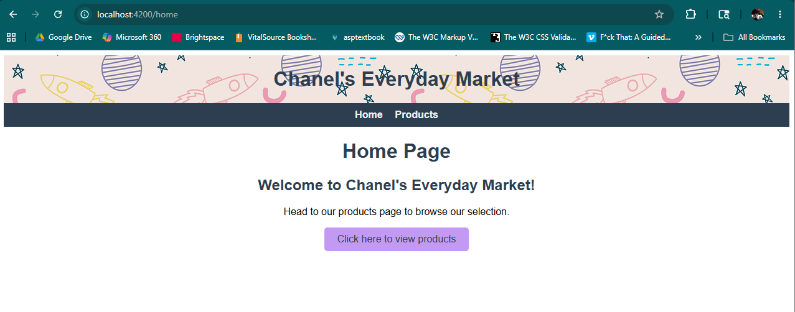

### Products Page
Once you have navigated to the `Products Page` page, it will load as shown here:
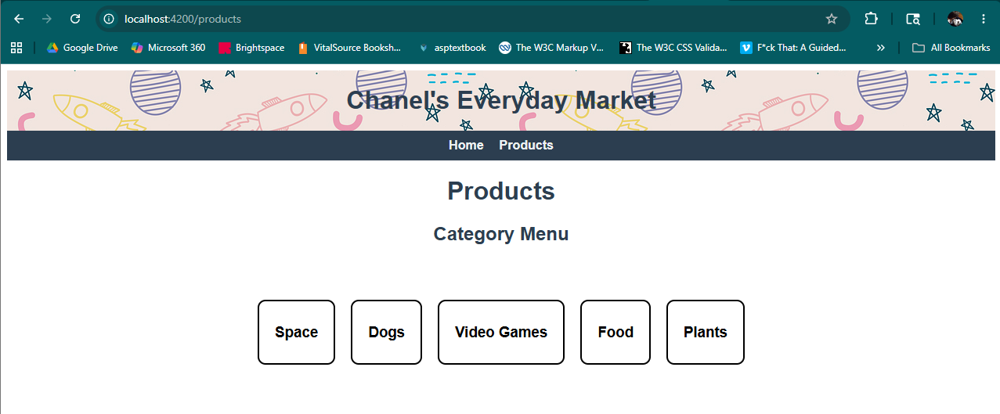

You can then test the Event tracking by parent `Category Menu` of child `Category Menu Item` by clicking on a category box (a `Category Menu Item` component) and seeing that `Category Menu` creates a notification of which category box was clicked:
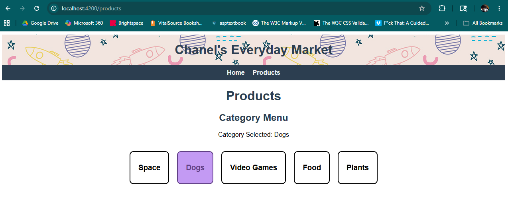

## References
I used the instructions from Practice Activities 1, 2, and 3 extensively. They were extremely helpful!


# Module_3_Assignment

## Introduction
Building on Module 1 Assignment, I added routing and a validated registration form with custom validation.

## Requirements
- Node.js
- Angular CLI
- an IDE (I used Visual Studio Code) with integrated terminal

## Update Dependencies
With the initial project already a week old, the dependencies need to be updated.
```bash
npm update
```

This added 1 package and updated 41 packages.

## How it Works
The application has a global component `Header` with a background image and a navbar, and three page components, `Home`, `Products Page`, and `Register Page`.

On the `Register Page` page, the focus of this assignment, you will the registration form with many input boxes and a grayed out submit button. The submit button is blanked out and cannot be pressed until the form is filled out correctly.

### Form Validation
Each input box has validation.

`Name` uses built in validators:
- `required` 
- `minLength` with a minimum length of 5
- `pattern` using a regular expression to allow only letters and spaces. I used the regular expression from Module 3 Practice Assignment 4.
```ts
Validators.required, 
Validators.minLength(5),
Validators.pattern('^[a-zA-Z ]+$')
```

`Email` uses built in validators:
- `required` 
- `email` which checks specifically for valid email format
```ts
Validators.required, 
Validators.email
```

`Phone` uses built in validators:
- `required` 
- `pattern` using a regular expression to allow only numbers and requires 10 digits. I used the regular expression provided by CoPilot as soon as I typed in "phone".
```ts
Validators.required, 
Validators.pattern('^[0-9]{10}$')
```

`Date of Birth` uses built in validator:
- `required`
- Note 1: Date of Birth input is set as type `date picker` thus it already supplies the required yyyy-mm-dd sans validation.
- Note 2: I could not figure out in time how to set the maximum date allowed within the picker to always be today. I have therefore set it to today's date (May 24) and will figure it out another day.

`Street Address` uses built in validators:
- `required` 
- `pattern` using a regular expression to allow any letters, number, and spaces. I modified the regular expression used in `Name`
```ts
Validators.required, 
Validators.pattern('^[a-zA-Z0-9 ]+$')
```

`Province` uses built in validator:
- `required`
- Note: No other validator is required as this is a `select` aka a dropdown menu. The only user error could be leaving it blank, which required validates for.

`Country` uses built in validator:
- `required`
- Note: No other validator is required as this is a `select` aka a dropdown menu. The only user error could be leaving it blank, which required validates for... 

Except in this case one of the selections doesn't work for us so `Country` also uses custom validator `countryValidator` set to only accept Canada as :
```ts
countryValidator('Canada')
```

`Terms and Conditions` uses built in validator:
- `requiredTrue`
- Note: As type `checkmark`, it can only be false (left empty) or true (checked), thus `requiredTrue`.

### Custom Validator - countryValidator()
To set up a custom validator, I set up the file `registration-validators.ts` with the exported function `countryValidator`.

This function extends imported Angular Form interface `ValidatorFn`. It takes in the parameter `allowedCountry`, which in our case is `Canada` which is passed in from `register-page.ts` where the function is called.

```ts
export function countryValidator(allowedCountry: string): ValidatorFn {
  return (control: AbstractControl): ValidationErrors | null => {
    const value = control.value;
      if (!value) {
        return null;
      }
    return value === allowedCountry ? null : { invalidCountry: true };
  };
}
```

This function uses the form control and assesses it to return either `ValidationErrors` or null.

It works by first checking if the value of the form input (Control.value) is null. If so, it returns null which is treated as passing the validator (Hence why `required` must also be used).

If the value is not null, it then checks it against the `allowedCountry` value. If it matches, null will be returned (ie passes the validator). If it doesn't match, the validator returns a validation error of `invalidCountry`. The errors are stored in the form control.

Back in `register-page.html`, if `invalidCountry` is true it triggers this if control flow:
```html
@if (registerForm.get('userCountry')?.touched && registerForm.get('userCountry')?.invalid) {
  @if (registerForm.get('userCountry')?.errors?.['invalidCountry']) {<span>Currently, only customers from Canada are accepted, sorry!</span>}
}
```

### Routing
The special routing upon submiting the form is done by importing `Router`
```ts
import { Router } from '@angular/router';
```

Adding this route to the `onSubmit` function:
```ts
this.router.navigate(['/products'])
```

And binding it to the submit button via `ngSubmit` which is a built in submit form event emitter in Angular Reactive Forms:
```html
<button (ngSubmit)="onSubmit()" >Submit</button>
```

## Testing
### Development Server
To start a local development server, run:

```bash
ng serve
```

Once the server is running, open your browser and navigate to `http://localhost:4200/`.

### Build
Create a production build
```bash
ng build
```

### Test
Run the unit tests
```bash
ng test
```

All tests passed.

### Lint
Lint the code
```bash
ng lint
```

All files passed linting.

### Register Page
Once you have navigated to the local server, the application will load the `Register` page
rather than the previous `Home` page since I changed the routing:

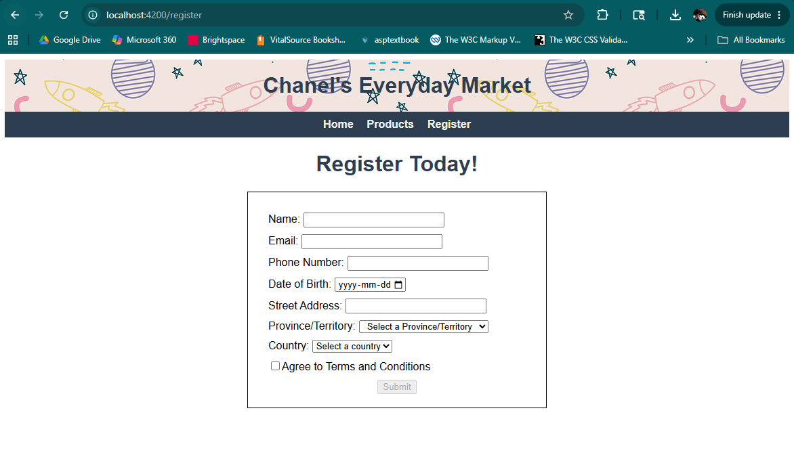

### Registration Form
From here, I initially filled the form correctly:
- Note: See the change of state of the submit button from the previous image, it can now be clicked.

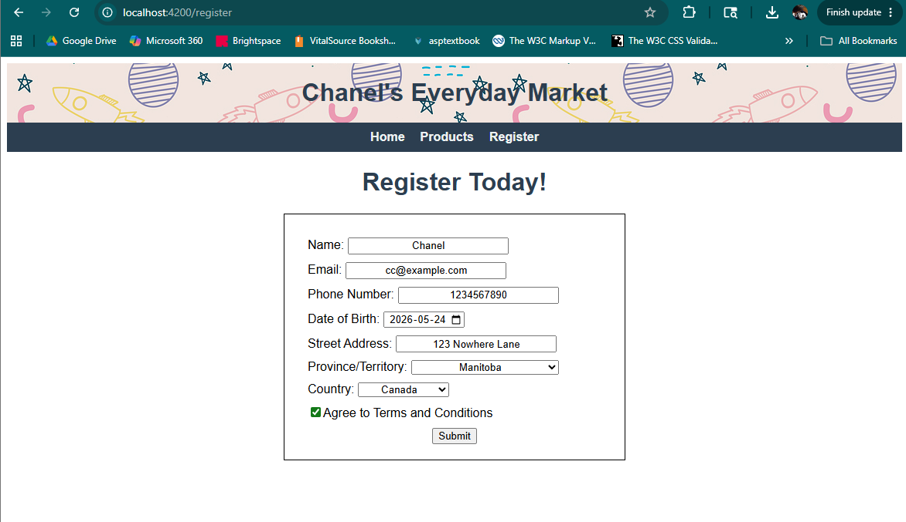

#### Submit Alert and Routing
Upon clicking submit, an alert pops up shows registration was successful:

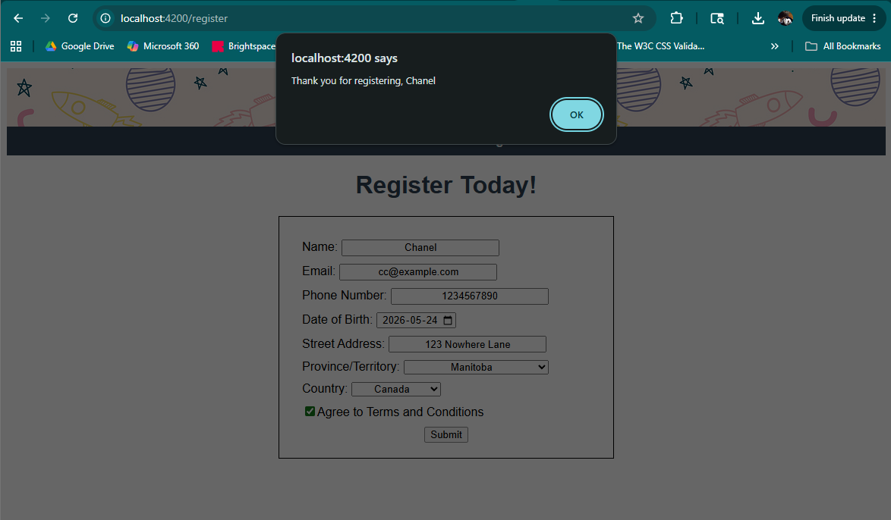


Upon closing the alert by clicking `OK`, the application continues to route to the products page
as the submit button routes there:

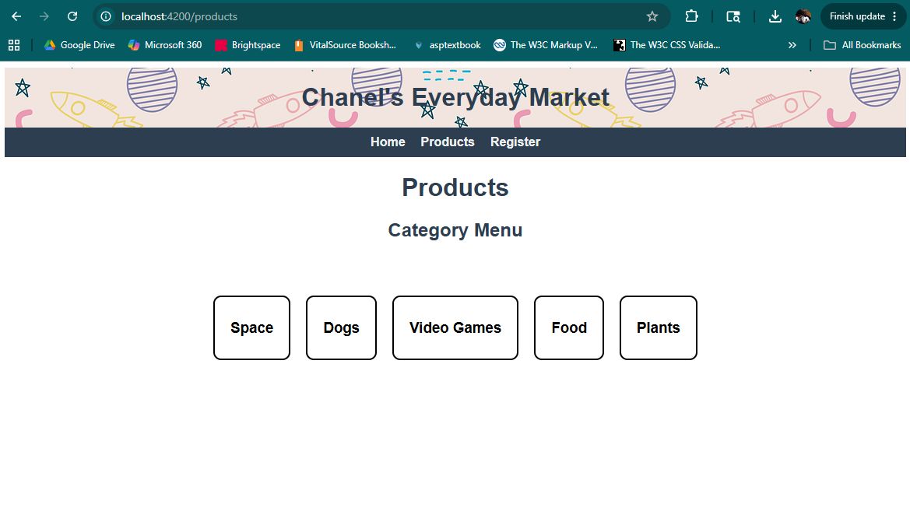

#### Form Validation
Going back to the `Register` Page, I clicked all the boxes to show the visual indicators and warnings on fields that are touched and left blank:
- Note: The submit button is blanked out and cannot be pressed until the form is filled out correctly.

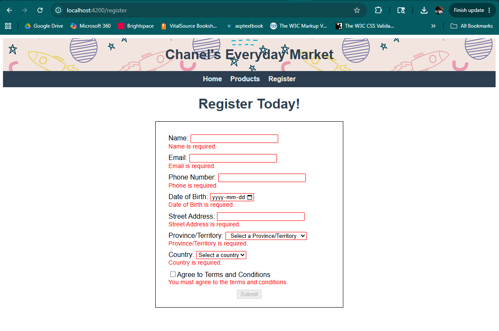

To show the various validators at work, including the custom validator, I filled out the form incorrectly to see the 
indicators and warnings:
- Note 1: The submit button is blanked out and cannot be pressed until the form is filled out correctly.
- Note 2: Notice the custom validation for the `Country` input. Despite being filled out, it is not
an acceptable input.

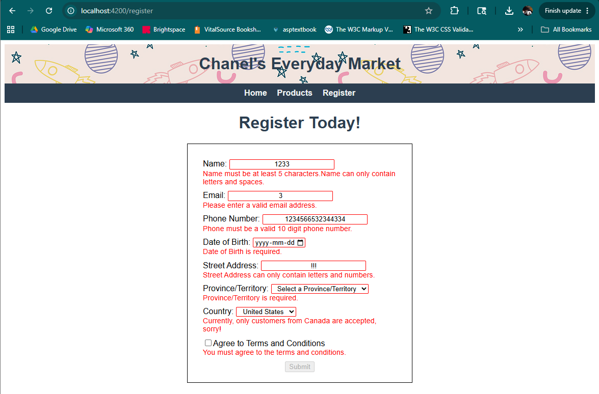


## References
- Module 3 Practice Activities 1 and 4
- [HTML <input> type Attribute](https://www.w3schools.com/tags/att_input_type.asp)
- [HTML Form Elements](https://www.w3schools.com/html/html_form_elements.asp)


# Module_4_Assignment

## Introduction
Deploying Module 3 Assignment as an Azure static Web App, executing CI/CD pipeline via GitHub Actions.

## Requirements
[My Deployed Azure App](https://red-tree-0b91ba210.7.azurestaticapps.net)

### For editing/ viewing code:
- GitHub
- Azure

## Deploying the Angular App
### 1. GitHub Repository
I had previously set up Assignment 3 as a GitHub repository so this step was already done :)

### 2. Create a Production Environment on Microsoft Azure
Following Microsoft's Quickstart Guide (see references), with GitHub as the code hosting platform, I created a `Static Web App`. 

I was slightly confused and set up the `App Location` as `/src/app`, assuming the base of the app was `app`, and `Output Location` as `dist/angular-basic`, forgetting to change this from the guide for my own project.

Despite these big issues, the workflow showed that it had `Succeeded`. The site page showed absolutely blank with no errors.


### 3. Set Up GitHub Actions for CI/CD
After setting up the production environment via Azure, GitHub Actions was automatically set up. Every change committed to the repository triggered a workflow.

In GitHub `Actions` I went to the succesful workflow and saw two issues: 
- A warning saying "Node.js 20 actions are deprecated"
- And red text under Build and Deploy saying "Could not detect any platform in the source directory. Error: Could not detect the language from repo."

I googled the first issue then I went to the workflow setup doc `azure-static-web-apps-red-tree-0b91ba210.yml` and added in the suggested code to load the newwer version of node. This did not work and I later removed this.

I googled the second one, and it said that my `app_location` and/ or `output location` were wrong. Refering to the `Deploying to Azure Static Web App` article (see references), I went to the workflow setup doc and found where to update the mistakes I had made earlier. `app_location`, which I changed wrongly to `/src` thinking the file containing `Index.html` was what was needed. And still misunderstanding the requirement for `output location` I changed it to `dist/Everyday_Market_App_A3/browser`.

Still the page was blank.

I attempted to use CoPilot to determine what I was missing. Through it's suggestion, I changed the `output location` to the proper name of the app found in `angular.json`, plus the "/browser" shown in the assignment instructions: `dist/Everyday_Market_App/browser`.

Still the page was blank.

Using CoPilot, Google, the suggested docs, and the synch session, I made many small changes attempting to determine my issue. Nothing worked and an hour later I sent an email requesting help from the prof, Joanne Hoar. I continued to make small changes (and took a chips and salsa break) until I heard back.

Joanne noted that thought the app is deploying, the `<app-root></app-root>` is empty meaning angular isnt working. She suggested to check that the `output location` in `angular.json` matches the one in the workflow setup. She also suggested needing a navigation fallback to help with any routing issues, giving the example code for a file called `staticwebapp.config.json`:
```json
{
  "navigationFallback": {
    "rewrite": "/index.html"
  }
}
```

In `angular.json` there was no `output location` so I googled where it should go in the file structure and added it, matching the one in the webflow setup file: `dist/Everyday_Market_App_A3/browser` (this would later prove to be a bit wrong).

Still the page was blank so I tried the second suggestion. After a few syntax errors, I could see the workflow was succeeding to read the config file. But still no luck!

I looked up Joanne's sample workflow setup file and noticed that she had set the `app location` as `/`. I made this change in my file and, though the workflow did not succeed, this was the first time I saw that the app had been built in the workflow:

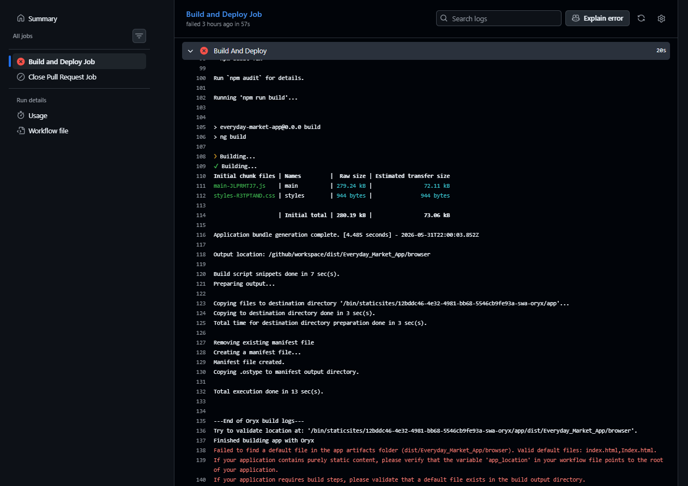

I knew I was on the right track!

Still the page was blank, so I made small changes here and there to see what syntax I had wrong. Nothing.

Finally I double checked `angular.json` and removed the "/browser". It worked!

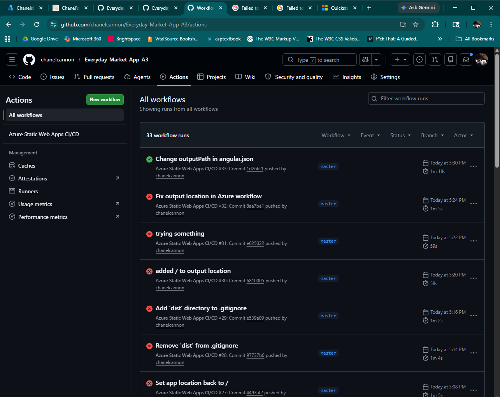

### 4. Deploy Your Angular App
The app deployed succesfully: 

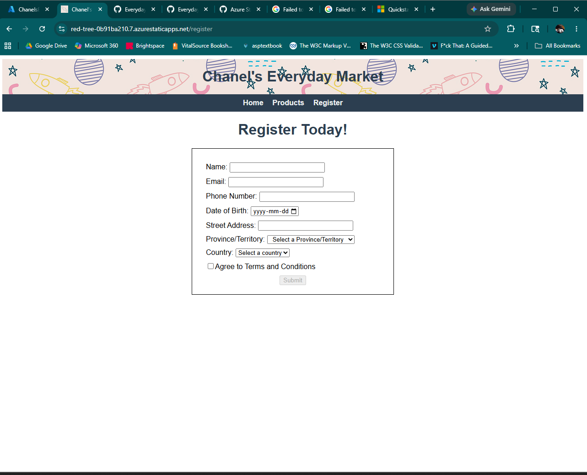

And was publicly accesible (shown here on a different browser where I was not logged into Azure):

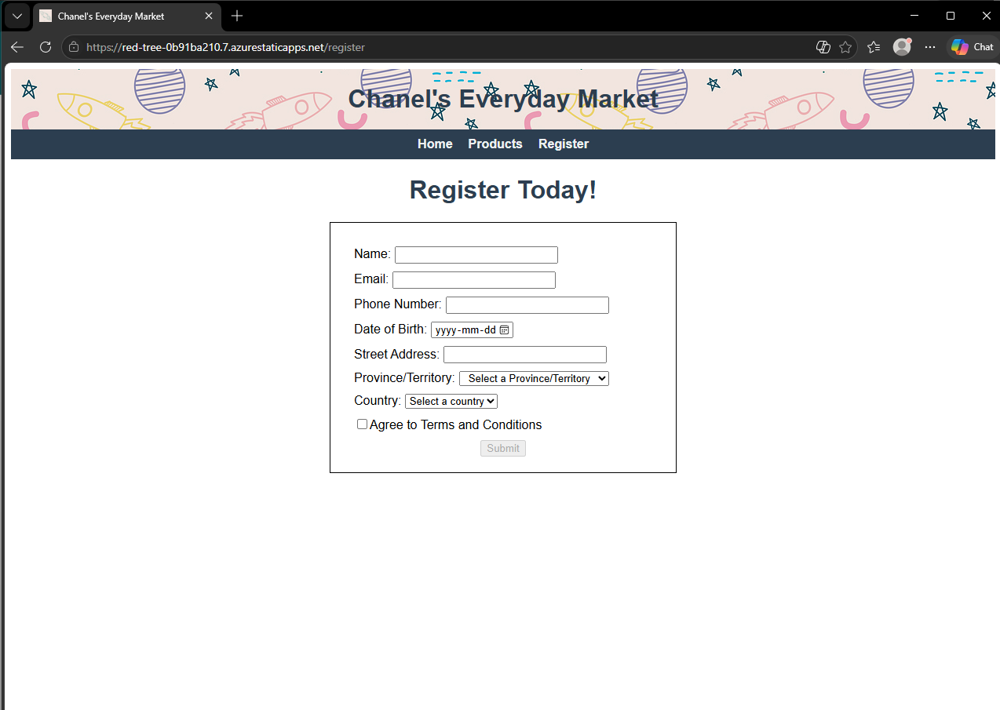

#### I then tested the functions of the site:
The form successfully filled and submitted:

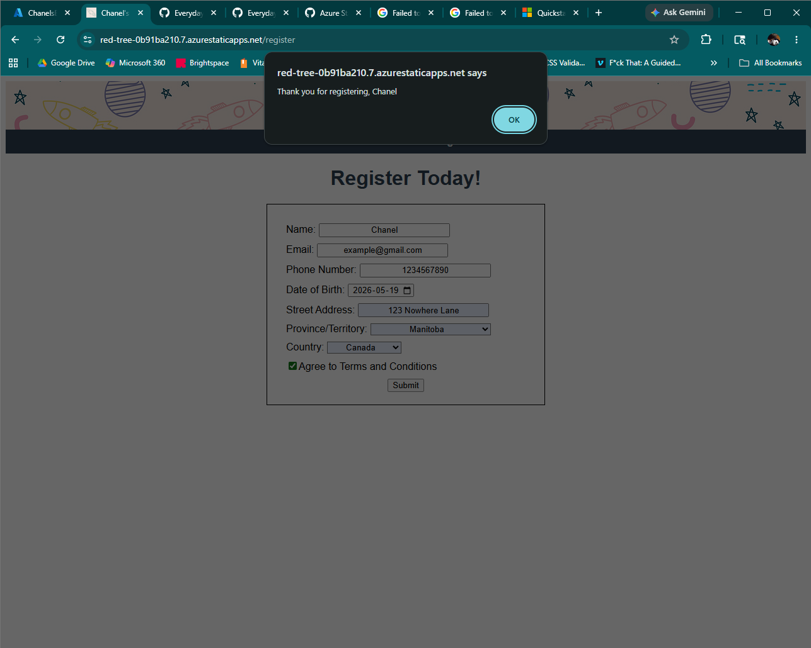

The form validations:

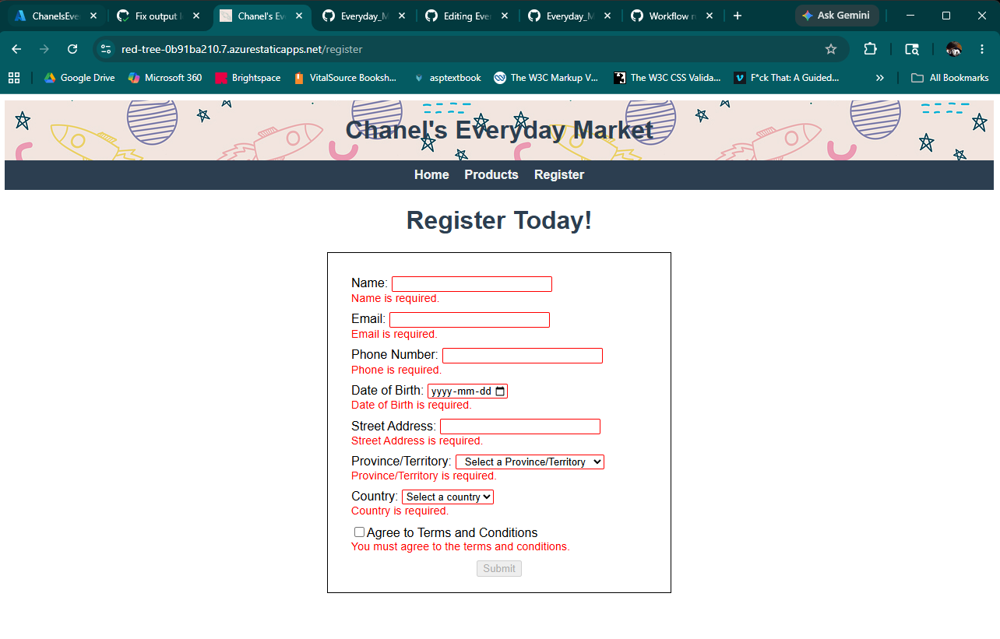

The auto routing to `Products Page` after form submission as well as via the nav bar and home pgae button:

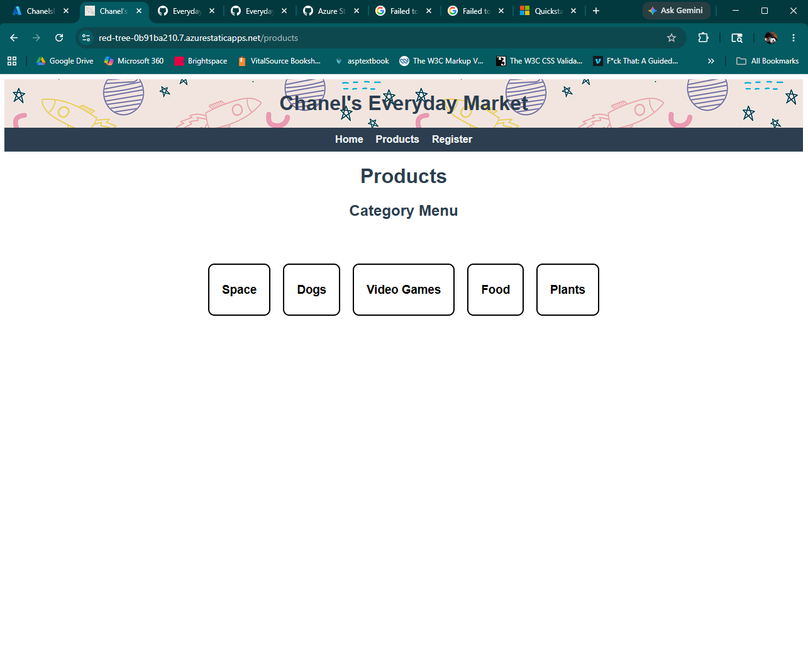

The `Products Page` Click event:

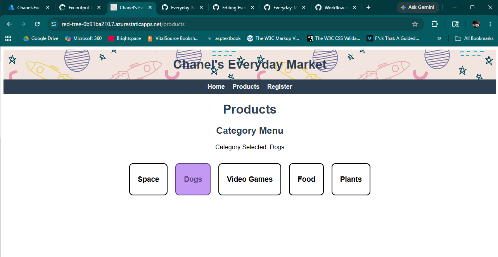

The `Home Page`:

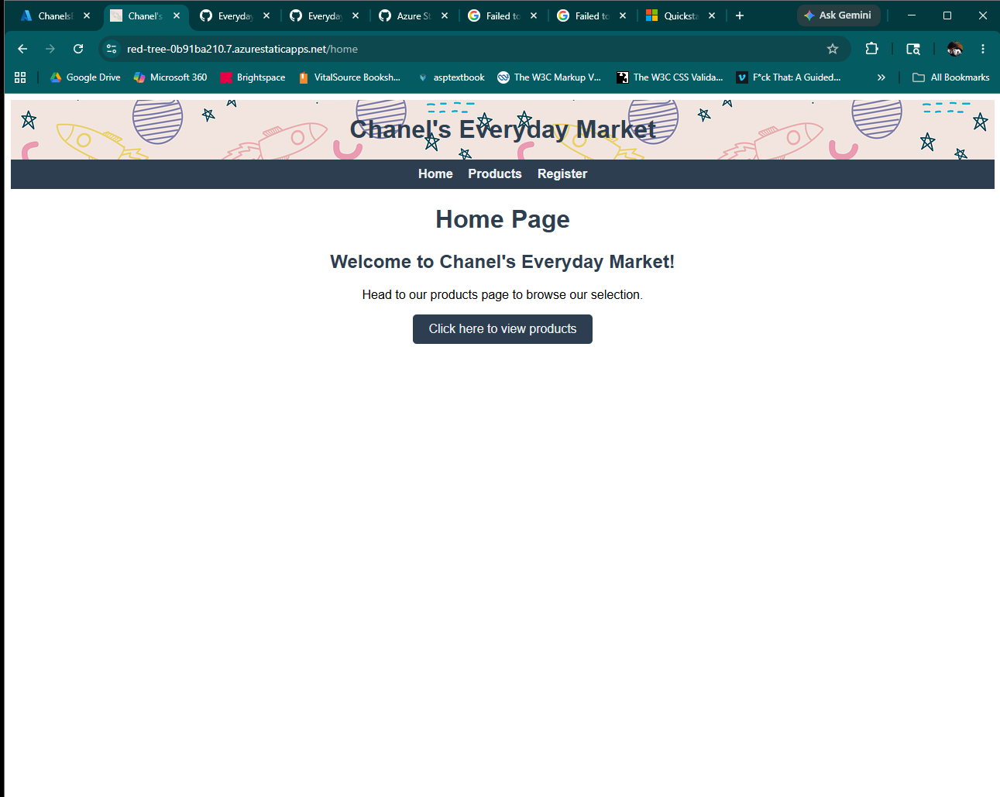

### Other Notes


## References
[Quickstart: Build your first static web app](https://learn.microsoft.com/en-us/azure/static-web-apps/get-started-portal?tabs=angular&pivots=github)
[Deploying to Azure Static Web App](https://docs.github.com/en/actions/how-tos/deploy/deploy-to-third-party-platforms/azure-static-web-app)


